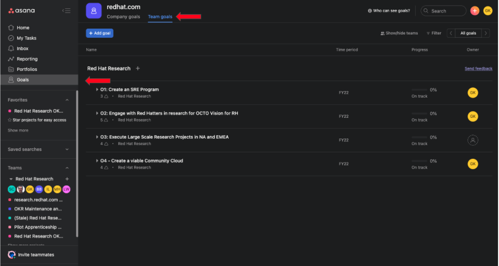

OKR Tracking
============

.. _asana:

OKRs as Goals in Asana
------------------------

The Research team will be tracking the team's Objective and Key Results as Goals in the Asana application. The OKRS were derived from RHR's `3-year vision document <https://docs.google.com/document/d/1syjL-FOQufBBPOzEMP-bc3ZkiDajklK5vfXjV0nySoc/edit?usp=sharing>`_. Follow the below steps to view the Red Hat Research team's OKRs in Asana:

1. If you don't have an account in Asana, `create an account <https://asana.com/create-account>`_ using your Red Hat e-mail address.

2. After signing up, use `this link <https://app.asana.com/share/redhat/red-hat-research/842652237098/24557707565ea8127e3d85ec466c194c>`_ to get access Red Hat Research Team's Goals. 

3. After joining the Research team, click on the Goals option.

If you are unable to see any goals, select the 'Red Hat Research' team option from the show/hide teams option.

.. image:: images/search-team.gif
    :width: 600px
    :align: center
    :alt: alternate text

