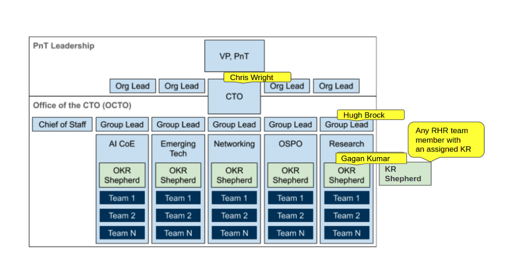

OKR Tracking
============

.. _roles:

Roles & responsibilities 
------------------------

The diagram below shows the roles associated with OKRs within the OCTO with the names of the people assigned to them. These roles are explained in the `OKR Practice <https://docs.google.com/document/d/1mAzjBzNQP6Dw4DPDOd0EXVNcmozrpDSwApEImVd3Ifo/edit?ts=5ea9b1e1#>`_ in the CTO Office. In this document, only the roles of OKR Shepherd and KR Shepherd also known as KR Owner will be explained in detail within this document.

* **OKR Shepherd**

Within each OCTO Group, there will be one or more OKR Shepherds that are tasked with keeping OKR records up to date and working with their OCTO Group Lead and KR Shepherds to help set OKRs for the group and for the individual teams.

* **KR Shepherd/KR Owner**

Within the Red Hat Research Program Group, there will be one or more KR Shepherds also known as KR Owners who are tasked with keeping KR records they own up to date and working with their OCTO Group Lead and their OKR Shepherd to help set OKRs for the group. As defined in the `Research Team OKRs presentation <https://docs.google.com/presentation/d/1AOttrlOcmITFnpr2_apm787eKzj1ZC-Yy6qsJz5JXkk/edit#slide=id.g8252c01281_0_9>`_ “KR Shepherds own nagging and reporting, are not team leads and meet as a group to groom KRs.”

 * RACI analysis:

  1. The KR Shepherd is responsible for ensuring that their specific KRs are completed/met by taking the following actions:

   * Meeting with their OCTO Group Lead quarterly to review old group-level OKRs and support the creation of new ones.

   * Meeting with their OCTO Group Lead, OKR Shepherd, and team to groom KRs and ensure that expectations are clear.

   * Enroll contributors to help them implement their KRs. KR contributors may or may not belong to the RHR Group.

   * Meeting / following up with their KR Contributors at least on a weekly basis to track and report progress.

   * Raising the alarm if their KRs are at risk and look for ways to mitigate the risks.

 2. The KR Shepherd is responsible for determining how their KR’s will be graded. They need to convey their grading system to the OKR Shepherd. 

 3. The KR Shepherd is accountable for the availability of relatively current KR data for their OCTO Group in the `RHR Asana Goals <https://app.asana.com/0/goals/1200485613117936/list>`_.

 4. The KR Shepherd is informed by the OCTO Group Lead when out-of-cycle changes are made to top-level OKRs or group-level OKRs.

 5. The KR Shepherd will meet with the OKR Shepherd, at least on a monthly basis, to grade its KRs in preparation for the quarterly review of the group-level OKRs.

